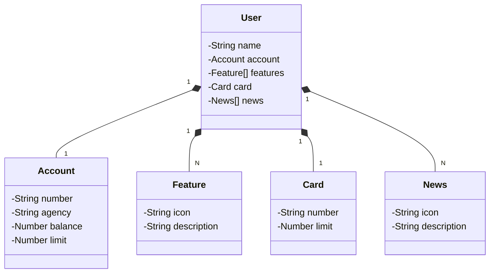

# Projeto API REST na Nuvem Usando Spring Boot, Java e Railway

Java RESTful criada para fins educativos/aprendizagem.

## Principais Tecnologias:
- **Java 21**
- **Spring Boot 3**
- **Spring Data JPA**
- **OpenAPI (Swagger)**
- **Railway**

 ## Diagrama de Classes (Domínio da API)

  ## Estrutura do Código
  
# Sistema de Usuário Bancário

Este projeto representa um modelo de usuário bancário com informações sobre conta, recursos, cartão e notícias.

O sistema contém as seguintes classes:

- `User`: Representa o usuário, contendo nome, conta bancária, lista de recursos, cartão e notícias associadas.
- `Account`: Armazena dados da conta bancária, como número, agência, saldo e limite.
- `Feature`: Define recursos disponíveis para o usuário, incluindo ícone e descrição.
- `Card`: Representa o cartão do usuário, contendo número e limite.
- `News`: Armazena notícias relacionadas ao usuário, incluindo ícone e descrição.

## Relações entre as Classes

- Um `User` possui uma `Account`.
- Um `User` pode ter vários `Feature` e `News`.
- Um `User` tem um `Card`.

## Como Utilizar

Este código pode ser utilizado como um modelo para sistemas bancários e aplicativos financeiros que necessitam de uma estrutura organizada para armazenar dados do usuário e seus relacionamentos com conta, cartão e outros elementos.

## Rianyquaresma

Criado por [Rianyquaresma]. Caso tenha dúvidas ou sugestões, entre em contato!
